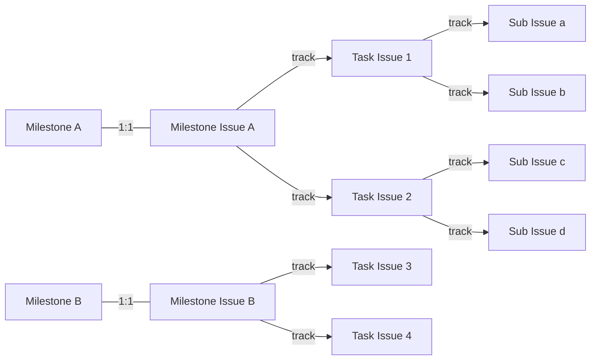
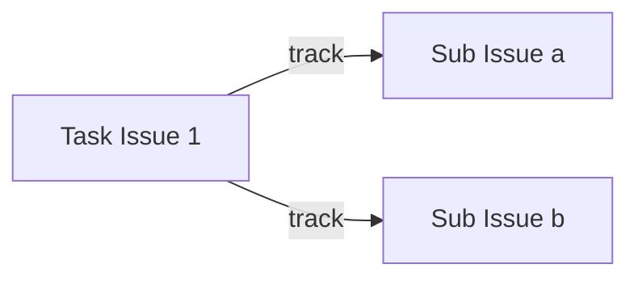

[](https://github.com/a24k/pablof/actions/workflows/ci.yml)
[](https://github.com/a24k/pablof/actions/workflows/dist.yml)
[](https://github.com/a24k/pablof/actions/workflows/codeql.yml)

# About

pablof -- a Productive Assistant for a Better Life OF you, your team, your family and our world.

This is a custom action for GitHub Actions to help you work with GitHub Issues and Projects (V2).

## Table of Contents

- [Usage](#usage)
- [Feature - Milestone Issue](#feature---milestone-issue)
    - [Action - Create Milestone Issue](#action---create-milestone-issue)
    - [Action - Sync Milestone Issue](#action---sync-milestone-issue)
- [Feature - Derived Issue](#feature---derived-issue)
    - [Action - Derive Issue](#action---derive-issue)

# Usage

## Beta

### Workflow Example

```yaml
name: pablof

on:
  issues:
    types: [opened]
  milestone:
    types: [created, opened, edited, closed, deleted]

jobs:
  pablof:
    runs-on: ubuntu-latest
    steps:
      - uses: a24k/pablof@milestone-issue
        with:
          token: ${{ secrets.GH_TOKEN }}
```

### Inputs

| Name    | Required | Type   | Description                                             |
| ---     | :---:    | ---    | ---                                                     |
| token   | ✓        | string | Personal Access Token with `repo` and `project` scopes. |

# Feature - Milestone Issue

[Milestone](https://docs.github.com/en/issues/using-labels-and-milestones-to-track-work/about-milestones)
is a better way to track progress on groups of issues.
It is very useful for managing project with multiple issues,
but there is not a sufficient way to describe or discuss about Milestone itself in detail.

## Concept

Milestone Issue is a issue linked 1:1 to Milestone.

As shown in the figure below, each Milestone has a linked Milestone Issue.
Each Issues in the Milestone should be tracked from the Milestone Issue.
All Issues on the Milestone consists of a single tree with the Milestone Issue as its root.



### How to identify the Milestone Issue

1. list issues linked with the Milestone
1. filter issues by `trackedInIssues.totalCount === 0`
1. the first issue, in order of `CREATED_AT ASC`, is the Milestone Issue

## Action - Create Milestone Issue

Automatically create a Milestone Issue when a Milestone is created.
The created Milestone Issue will inherit the `title` and `body` of the Milestone.

### Supported Triggers

| Name        | Action    |
| ---         | ---       |
| `milestone` | `created` |

### Works with Projects (V2)

If you have linked Projects on the Repository,
this action will add the Milestone Issue to every linked Projects.

#### Status Field

If the Project has a Field named `Status`,
this action will set the value of `Status` according to following rules in the order written.

1. If the `Status` Field has an Option named `Milestone`, set `Status` to `Milestone`.
1. If the `Status` Field has an Option named `Project`, set `Status` to `Project`.
1. Otherwise, set `Status` to first (most left) one.

#### Start Date Field

If the Project has a Field name matched with `/^(Begin|Start) [dD]ate$/`,
this action will set the field value to `createdAt` of Milestone.
Only affects for the first Field matched.

#### Target Date Field

If the Project has a Field name matched with `/^(Due|End|Finish|Target) [dD]ate$/`,
this action will set the field value to `dueOn` of Milestone.
Only affects for the first Field matched.

## Action - Sync Milestone Issue

Automatically updates the Milestone Issue when a Milestone is updated.
The updated Milestone Issue will have the same `title` and `state` as the Milestone.

### Supported Triggers

| Name        | Action    |
| ---         | ---       |
| `milestone` | `edited` `closed` `opened` |

### Works with Projects (V2)

If you have linked Items on the Milestone Issue,
this action will update Items linked with Projects.

#### Target Date Field

If the Project has a Field name matched with `/^(Due|End|Finish|Target) [dD]ate$/`,
this action will set the field value to `dueOn` of Milestone.
Only affects for the first Field matched.

# Feature - Derived Issue

When we are trying to achieve something, it is very important to break down the task.

## Concept

If a newly opened Issue `Sub Issue a`
is tracked 1:1 from the another Issue `Task Issue 1`,
we consider it is derived from `Task Issue 1`.
Typically,
this situation occurs when a new Issue is created
by clicking ["Convert to issue"](https://docs.github.com/en/issues/tracking-your-work-with-issues/about-tasklists#converting-draft-issues-to-issues-in-a-tasklist)
at the end of each items on the Tasklist.



## Action - Derive Issue

When a new Issue derived from another Issue,
this action copies the Parent Issue's attributes about Labels, Milestone and Projects.

### Supported Triggers

| Name     | Action   |
| ---      | ---      |
| `issues` | `opened` |

### Works with Projects (V2)

If the Parent Issue linked with Projects,
this action will add the Derived Issue to every linked Projects
and copy Field Values of Parent Project Items.

#### Status Field

If the Parent Project Item has a Field named `Status`,
this action will set the value of `Status` according to following rules in the order written.

1. Set `Status` to first (most left) one except named `Milestone` or `Project`.
1. Otherwise, set the same `Status` as the Parent Project Item.
