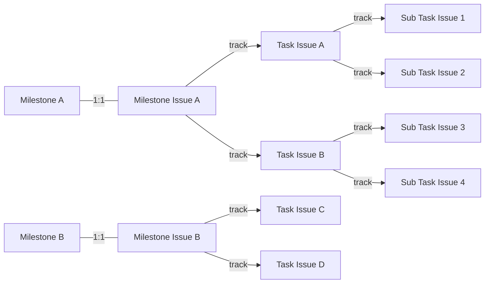

[](https://github.com/a24k/pablof/actions/workflows/test.yml)
[](https://github.com/a24k/pablof/actions/workflows/check-dist.yml)
[](https://github.com/a24k/pablof/actions/workflows/codeql-analysis.yml)

# About

pablof - a Productive Assistant for a Better Life OF you and your team.

# Usage

## Beta

### Workflow Example

```yaml
name: pablof - milestone

on:
  milestone:

jobs:
  pablof-milestone:
    runs-on: ubuntu-latest
    steps:
      - uses: a24k/pablof@milestone-issue-edited
        with:
          token: ${{ secrets.GH_TOKEN }}
```

### Inputs

| Name  | Required | Type   | Description      |
| ---   | :---:    | ---    | ---              |
| token | ✓        | string | a Personal Access Token with `repo` and `project` scopes.GitHub Token for |

# Features

## Milestone Issue


